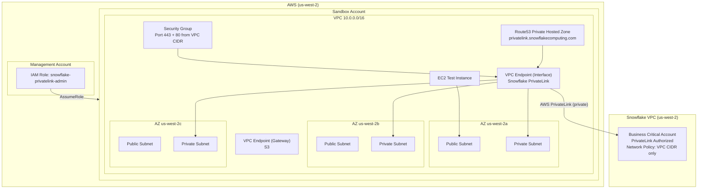
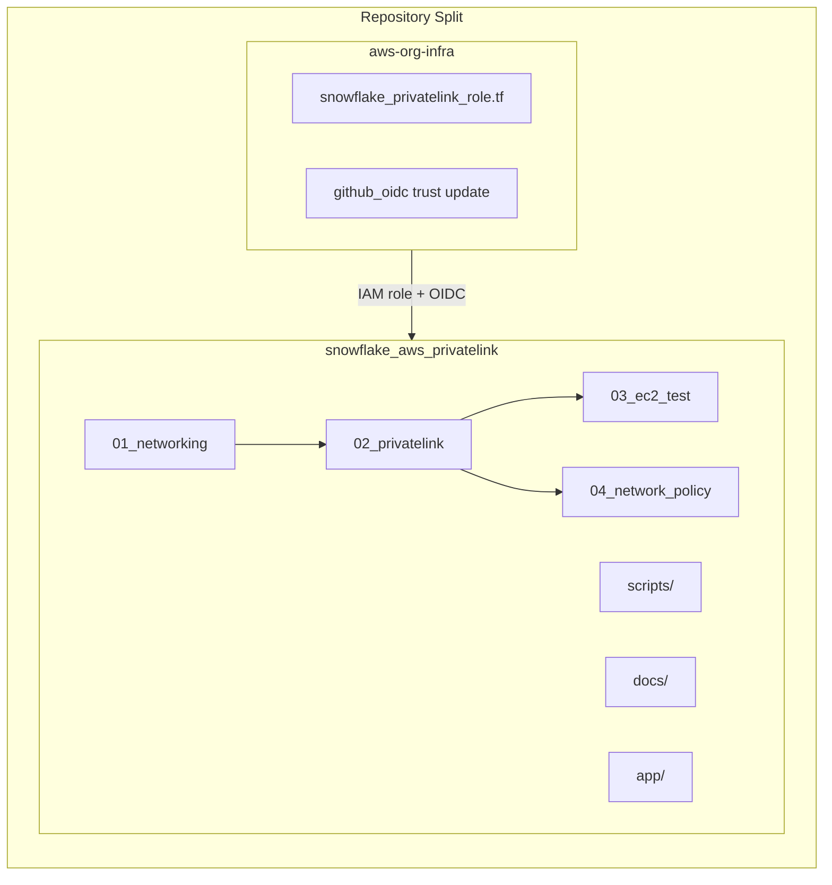
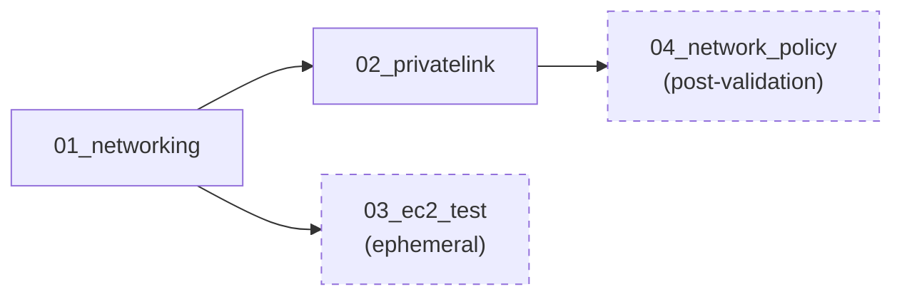

# Design — Snowflake AWS PrivateLink

## 1. Architecture Overview





## 2. Repository Structure

```
snowflake_aws_privatelink/
├── .github/
│   └── workflows/
│       └── terraform.yml              # CI/CD pipeline
├── terraform/
│   ├── 01_networking/                 # VPC, subnets, IGW, NAT, route tables
│   │   ├── main.tf
│   │   ├── variables.tf
│   │   ├── outputs.tf
│   │   ├── provider.tf
│   │   ├── backend.tf
│   │   └── versions.tf
│   ├── 02_privatelink/                # Auth user, VPCE, S3 gateway, SG, DNS
│   │   ├── auth.tf                    # IAM user for federation token
│   │   ├── main.tf                    # Security group, VPCE, S3 gateway
│   │   ├── dns.tf                     # Route53 hosted zone + CNAME records
│   │   ├── data.tf                    # Remote state lookups
│   │   ├── variables.tf
│   │   ├── outputs.tf
│   │   ├── provider.tf
│   │   ├── backend.tf
│   │   └── versions.tf
│   ├── 03_ec2_test/                   # Ephemeral EC2 for connectivity validation
│   │   ├── main.tf
│   │   ├── variables.tf
│   │   ├── outputs.tf
│   │   ├── provider.tf
│   │   ├── backend.tf
│   │   └── versions.tf
│   └── 04_network_policy/            # Snowflake network policy (post-validation)
│       ├── main.tf
│       ├── variables.tf
│       ├── provider.tf
│       ├── backend.tf
│       └── versions.tf
├── scripts/
│   ├── authorize-privatelink.sh       # One-time: generate token + run SQL
│   ├── verify-privatelink.sh          # Check authorization status
│   ├── revoke-privatelink.sh          # Cleanup: revoke authorization
│   └── test-connectivity.sh           # Run from EC2: nslookup + telnet tests
├── docs/
│   ├── architecture.md                # Architecture diagram + explanation
│   ├── runbook.md                     # Step-by-step operational guide
│   ├── checklist.md                   # Adapted from book's Table 2-2
│   └── troubleshooting.md            # Common issues + fixes
├── app/                               # Application code (connector validation)
│   └── README.md                      # Placeholder — future app code
├── .gitignore
├── .pre-commit-config.yaml
└── README.md
```

## 3. Workspace Dependency Order



| # | Workspace | State Key | Depends On |
|---|-----------|-----------|-----------|
| 1 | `01_networking` | `projects/snowflake-privatelink/networking/terraform.tfstate` | None |
| 2 | `02_privatelink` | `projects/snowflake-privatelink/privatelink/terraform.tfstate` | 01_networking |
| 3 | `03_ec2_test` | `projects/snowflake-privatelink/ec2-test/terraform.tfstate` | 01_networking |
| 4 | `04_network_policy` | `projects/snowflake-privatelink/network-policy/terraform.tfstate` | 02_privatelink validated |

## 4. IAM Role Design (Management Account)

File: `aws-org-infra/01_org_setup/03_security/01_management_iam/snowflake_privatelink_role.tf`

```hcl
# Role: snowflake-privatelink-admin
# Purpose: Scoped role for managing Snowflake PrivateLink infrastructure
# Assumable by: existing admin user in management account
# Permissions:
#   - sts:GetFederationToken (for Snowflake authorization)
#   - sts:AssumeRole (into sandbox account)
#   - ec2:*VpcEndpoint*, ec2:*SecurityGroup*, ec2:Describe*
#   - route53:* (scoped to private hosted zones)
#   - ec2:RunInstances, ec2:TerminateInstances (for test EC2)
#   - s3:* on state bucket (for Terraform state)
```

**Trust Policy:** Only the existing management account admin user can assume this role.

**Permission Boundaries:**
- Cannot create/delete VPCs (only endpoints within existing VPCs)
  - NOTE: Since we ARE creating the VPC, VPC create/delete IS needed
- Cannot modify IAM (no privilege escalation)
- Cannot access services outside the PrivateLink scope

## 5. Cross-Repository Operations

### What happens in `aws-org-infra`:

| Action | File/Workspace | When |
|--------|---------------|------|
| Create `snowflake-privatelink-admin` role | `03_security/01_management_iam/snowflake_privatelink_role.tf` | Before any project work |
| Add OIDC trust for `snowflake_aws_privatelink` repo | `03_security/03_github_oidc/main.tf` | Before CI/CD |
| Scaffold sandbox project (optional) | `./scripts/new-project.sh snowflake-privatelink --sandbox` | Optional — we're building custom |

### What happens in `snowflake_aws_privatelink`:

| Action | Workspace | When |
|--------|-----------|------|
| Provision VPC | `terraform/01_networking` | First |
| Create VPCE + DNS | `terraform/02_privatelink` | After networking |
| Spin up EC2 for testing | `terraform/03_ec2_test` | After privatelink |
| Run connectivity tests | `scripts/test-connectivity.sh` | Via SSH into EC2 |
| Apply network policy | `terraform/04_network_policy` | After tests pass |
| Destroy EC2 test | `terraform destroy` in `03_ec2_test` | After validation |

## 6. Provider Configuration

### AWS Provider (all workspaces in snowflake_aws_privatelink):

```hcl
provider "aws" {
  region = "us-west-2"

  # Assume role into the sandbox account
  assume_role {
    role_arn = "arn:aws:iam::<SANDBOX_ACCOUNT_ID>:role/OrganizationAccountAccessRole"
  }

  default_tags {
    tags = {
      "project:name"        = "snowflake-privatelink"
      "project:environment" = "sandbox"
      "project:owner"       = "cloudops-team"
      "project:managed-by"  = "terraform"
      "project:repo"        = "snowflake_aws_privatelink"
      "project:cost-center" = "data-platform"
    }
  }
}
```

### Snowflake Provider (02_privatelink, 04_network_policy):

```hcl
provider "snowflake" {
  profile                  = "default"  # reads from ~/.snowflake/config
  role                     = "ACCOUNTADMIN"
  preview_features_enabled = ["snowflake_system_get_privatelink_config_datasource"]
}
```

Authentication is stored in `~/.snowflake/config` (password-based, not committed to git).

## 7. Security Considerations

- **No long-lived credentials in code** — OIDC for CI/CD, local profiles for dev
- **Security groups scoped to VPC CIDR only** — no 0.0.0.0/0 rules
- **EC2 SSH restricted to operator IP** — not open to internet
- **EC2 is ephemeral** — stopped after testing, destroyed when PrivateLink is stable
- **Network policy blocks public access** — applied only after validation succeeds
- **Federation token not stored** — generated at runtime via auth user, used once, discarded
- **Auth IAM user scoped to single action** — only `sts:GetFederationToken`, no other access
- **Snowflake provider auth** — password-based via `~/.snowflake/config` (not committed to git)

## 8. Checklist (IaC Equivalents)

| Book Checklist Item | IaC Equivalent |
|-------------------|----------------|
| AWS Account ID | `data.aws_caller_identity.current.account_id` |
| VPC Name / CIDR | `aws_vpc.main` resource, variable `vpc_cidr` |
| Security Group ID | `aws_security_group.snowflake_privatelink.id` |
| PrivateLink-vpce-id | `data.snowflake_system_get_privatelink_config.this.aws_vpce_id` |
| Snowflake Region | Variable `snowflake_region` (us-west-2) |
| privatelink-account-url | `data.snowflake_system_get_privatelink_config.this.account_url` |
| Endpoint DNS Name | `aws_vpc_endpoint.snowflake.dns_entry[0].dns_name` |
| EC2 Instance | `aws_instance.test` resource |
| Key-Pair | `aws_key_pair.test` resource |
| S3-Traffic-Endpoint-IPs | `aws_vpc_endpoint.s3` (gateway, no IPs — uses route table) |

## 9. Commands Reference

### Run in `aws-org-infra` folder:

```bash
# 1. Create the IAM role (first time only)
cd 01_org_setup/03_security/01_management_iam
terraform plan
terraform apply

# 2. Update OIDC trust (for CI/CD)
cd 01_org_setup/03_security/03_github_oidc
terraform plan
terraform apply
```

### Run in `snowflake_aws_privatelink` folder:

```bash
# 0. Create GitHub repo
gh repo create snowflake_aws_privatelink --private --clone

# 1. One-time Snowflake authorization
./scripts/authorize-privatelink.sh

# 2. Apply workspaces in order
cd terraform/01_networking && terraform init && terraform apply
cd ../02_privatelink && terraform init && terraform apply
cd ../03_ec2_test && terraform init && terraform apply

# 3. Test connectivity (SSH into EC2, run tests)
ssh -i <key.pem> ec2-user@<public-ip>
# Inside EC2:
nslookup <account>.us-west-2.privatelink.snowflakecomputing.com
telnet <endpoint-ip> 443

# 4. After tests pass — lock down
cd ../04_network_policy && terraform init && terraform apply

# 5. Cleanup test resources
cd ../03_ec2_test && terraform destroy   # only when PrivateLink is confirmed stable
```

### Run in BOTH folders:

```bash
# Git operations after all work is done
# In aws-org-infra:
git add -A && git commit -m "feat: add snowflake-privatelink-admin IAM role"
git push

# In snowflake_aws_privatelink:
git add -A && git commit -m "feat: initial project structure"
git push -u origin main
```
