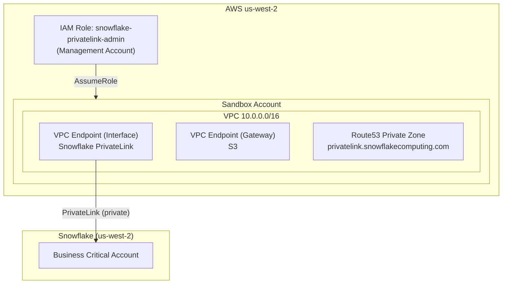

# Snowflake AWS PrivateLink

Private connectivity between an AWS VPC and a Snowflake Business Critical account
using AWS PrivateLink. All traffic stays on the AWS backbone — never traverses
the public internet.

## Architecture



## Quick Start

```bash
# 1. Assume the PrivateLink admin role
export AWS_PROFILE=snowflake-privatelink

# 2. One-time Snowflake authorization
./scripts/authorize-privatelink.sh

# 3. Apply workspaces in order
cd terraform/01_networking && terraform init && terraform apply
cd ../02_privatelink && terraform init && terraform apply
cd ../03_ec2_test && terraform init && terraform apply  # for testing

# 4. Validate connectivity (SSH into EC2)
# 5. Lock down public access
cd ../04_network_policy && terraform init && terraform apply
```

## Repository Structure

```
terraform/
├── 01_networking/       # VPC, subnets, IGW, NAT, route tables
├── 02_privatelink/      # VPCE, S3 gateway, security groups, DNS
├── 03_ec2_test/         # Ephemeral EC2 for connectivity validation
└── 04_network_policy/   # Snowflake network policy (post-validation)
scripts/                 # Helper scripts (authorization, testing)
docs/                    # Architecture, runbook, checklist, troubleshooting
app/                     # Application code (future)
```

## Prerequisites

- Terraform >= 1.10.0, < 2.0.0
- AWS CLI configured with management account credentials
- Snowflake Business Critical account in us-west-2 with ACCOUNTADMIN access
- `snowflake-privatelink-admin` IAM role applied (see aws-org-infra)

## Related

- [aws-org-infra](https://github.com/midega-g/aws-org-infra) — Organization-level IAM role and OIDC trust
- [Snowflake PrivateLink Docs](https://docs.snowflake.com/en/user-guide/admin-security-privatelink)

## Tags

All resources are tagged with:

| Key | Value |
|-----|-------|
| `project:name` | snowflake-privatelink |
| `project:environment` | sandbox |
| `project:owner` | cloudops-team |
| `project:managed-by` | terraform |
| `project:repo` | snowflake_aws_privatelink |
| `project:cost-center` | data-platform |
