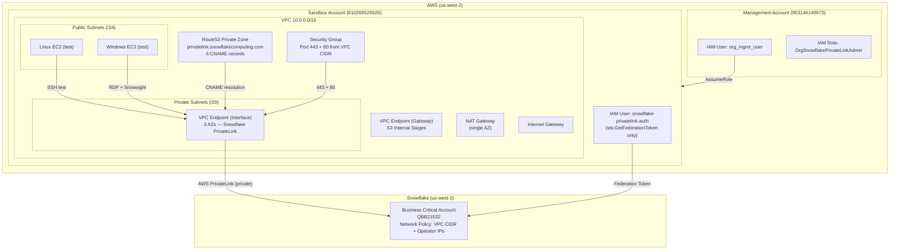

# Architecture — Snowflake AWS PrivateLink

## Overview

Private connectivity between an AWS VPC in the sandbox account (us-west-2) and a
Snowflake Business Critical account using AWS PrivateLink. All traffic stays on the
AWS backbone — never traverses the public internet.

---

## Architecture Diagram



---

## Network Flow

```
Client (inside VPC)
  → DNS query: qbb21532.us-west-2.privatelink.snowflakecomputing.com
  → VPC DNS resolver (10.0.0.2)
  → Route53 private hosted zone
  → CNAME → vpce-xxx.vpce-svc-xxx.us-west-2.vpce.amazonaws.com
  → Resolves to VPCE ENI private IPs (10.0.25.x, 10.0.35.x, 10.0.60.x)
  → TCP 443 to ENI
  → AWS PrivateLink (AWS backbone, never public internet)
  → Snowflake VPC
  → Response
```

---

## Components

### Networking (01_networking)

| Resource | Purpose |
|----------|---------|
| VPC (10.0.0.0/16) | Isolated network for all PrivateLink resources |
| 3 Public subnets (/24) | EC2 test instances, NAT Gateway |
| 3 Private subnets (/20) | VPC Endpoint ENIs |
| Internet Gateway | Outbound internet for public subnets |
| NAT Gateway (1 AZ) | Outbound internet for private subnets (cost-optimized) |
| Route tables | Public → IGW, Private → NAT |

### PrivateLink (02_privatelink)

| Resource | Purpose |
|----------|---------|
| Auth IAM user | Federation token for Snowflake authorization |
| Security Group | Allow 443 + 80 from VPC CIDR only |
| VPC Interface Endpoint | PrivateLink connection to Snowflake (3 AZs) |
| S3 Gateway Endpoint | Internal stage traffic stays on backbone |
| Route53 Private Zone | DNS resolution for PrivateLink URLs |
| 6 CNAME records | Account, OCSP, Snowsight (regional + regionless) |

### Test Instances (03_ec2_test)

| Resource | Purpose |
|----------|---------|
| Linux EC2 (t3.micro) | SSH, nslookup, telnet, SnowSQL tests |
| Windows EC2 (t3.small) | RDP, browser Snowsight access |
| Key pair (shared) | SSH + Windows password decryption |
| Security groups | SSH/RDP from operator IP only |

### Network Policy (04_network_policy)

| Resource | Purpose |
|----------|---------|
| Network policy | Restricts account access to allowed IPs |
| Account parameter | Activates policy at account level |

---

## Security Model

```
Layer 1: SCP (org-wide)
  └─ DenyNonAllowedRegions → only af-south-1, us-east-1, us-west-2

Layer 2: IAM (management account)
  └─ OrgSnowflakePrivateLinkAdmin → scoped to VPC/EC2/Route53/S3 state
  └─ ReadOnlyAccess → console visibility

Layer 3: Security Groups (sandbox account)
  └─ VPCE SG → 443 + 80 from VPC CIDR only
  └─ EC2 SGs → SSH/RDP from operator IP only

Layer 4: Network Policy (Snowflake)
  └─ VPC CIDR (10.0.0.0/16) → PrivateLink traffic
  └─ Operator IPs → debug/admin access
  └─ All else → blocked
```

---

## Cost Summary (Steady State)

| Component | Monthly Cost |
|-----------|-------------|
| NAT Gateway + EIP | $36.55 |
| VPC Interface Endpoint (3 AZs) | $21.90 |
| Route53 Private Zone | $0.50 |
| IAM, Security Groups, S3 Gateway | $0.00 |
| Network Policy (Snowflake) | $0.00 |
| **Total (steady state)** | **~$59.01/month** |

NAT Gateway can be destroyed when not needed (saves $36.55/month). PrivateLink
continues to work without it.

---

## Repository Structure

```
snowflake_aws_privatelink/
├── terraform/
│   ├── 01_networking/          # VPC, subnets, gateways, routes
│   ├── 02_privatelink/         # Auth user, VPCE, S3 gateway, DNS
│   ├── 03_ec2_test/            # Ephemeral test instances (destroy after use)
│   └── 04_network_policy/      # Snowflake network policy
├── scripts/
│   ├── authorize-privatelink.sh
│   ├── verify-privatelink.sh
│   ├── revoke-privatelink.sh
│   └── test-connectivity.sh
├── docs/
│   ├── implementation/         # Phase-by-phase implementation logs
│   ├── architecture.md         # This file
│   ├── runbook.md              # Operational guide
│   └── troubleshooting.md     # Common issues and fixes
└── .kiro/specs/                # Requirements, design, tasks, checklist
```
