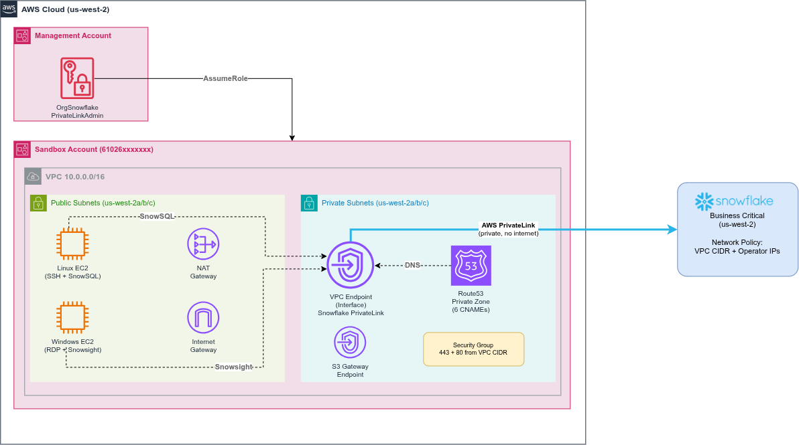

# Keeping Snowflake Traffic Off the Public Internet: AWS PrivateLink with Terraform

## The Problem

What do you do when you have data that cannot share a path with public traffic?

A routine query against a cloud data warehouse returns records that travel across the public internet before they reach your application. For most workloads that is acceptable, as long as the data is encrypted in transit. But some data does not get to be "most workloads." Think patient records under HIPAA, cardholder data under PCI-DSS, or anything a SOC 2 or FedRAMP auditor will ask pointed questions about. For these, encryption alone is not the whole story. The network path itself has to be isolated.

This is where two technologies meet: Snowflake as the data platform, and AWS PrivateLink as the private network path. This article walks through connecting an AWS VPC to a Snowflake Business Critical account over PrivateLink, end to end, with Terraform. By the end you will have a working private link, DNS that resolves Snowflake URLs to private IPs inside your VPC, and a Snowflake network policy that shuts the public door entirely.

### A Quick Word on Snowflake's Architecture

Snowflake is a fully managed service. When you create an account, Snowflake provisions the compute, storage, and metadata inside *their* AWS account, inside *their* VPC. You never see that infrastructure and you do not manage it.

Your side of the picture is different. Your applications, ETL jobs, and BI tools live in *your* AWS account, inside *your* VPC. When they connect to Snowflake, they resolve a public hostname such as `xyz.snowflakecomputing.com` to a public IP, and the traffic flows over the public internet.

Snowflake encrypts that traffic with TLS by default, so the payload is protected. The catch is that the *path* is still public. Anyone with visibility into the network between you and Snowflake can see that the two of you are talking, how often, and roughly how much data is moving. For a regulated workload, that metadata leakage is often enough to fail an audit.

### Where PrivateLink Comes In

AWS PrivateLink creates a private network path between your VPC and Snowflake's VPC. Traffic rides the AWS backbone and never touches the public internet. The practical effect:

* No internet gateway in the path.
* No public IP addresses.
* No exposure to anyone watching the public network.

That is exactly the "private connectivity" or "network segmentation" language that compliance frameworks like HIPAA, PCI-DSS, SOC 2, and FedRAMP use when they talk about protecting data in transit.

### Do You Actually Need This?

Before you commit time and money, be honest about which requirement you are solving, because PrivateLink is not the only answer.

| If the requirement is... | The right tool is... | Cost |
| --- | --- | --- |
| "Encrypted in transit" | Nothing. Snowflake forces TLS on every connection already. | Free |
| "Restrict access to known IPs" | A Snowflake network policy. A server-side allowlist, no AWS infrastructure. | Free |
| "Private network path, no public internet" | AWS PrivateLink. | See below |

PrivateLink has a real cost. It requires the Snowflake Business Critical edition, which runs roughly $4 to $6 per credit depending on your region. On the AWS side, the interface VPC endpoint is about $22 per month and a NAT gateway adds about $37 per month, so the minimum viable setup lands near $59 per month before you run a single query.

If the first two rows cover your case, stop here and save yourself the bill. The rest of this article assumes you have decided PrivateLink is genuinely required.

## What You Need Before Starting

To follow this end to end, line up the following first.

| Requirement | Why |
| --- | --- |
| Snowflake Business Critical account | PrivateLink is not offered on Standard or Enterprise editions. This is a hard gate. |
| Snowflake `ACCOUNTADMIN` access | Needed to authorize PrivateLink and later to set the network policy. |
| AWS account in the same region as Snowflake | PrivateLink does not cross regions. This build uses `us-west-2` for both. |
| AWS credentials that can create VPCs, endpoints, and Route 53 zones | The infrastructure spans networking, PrivateLink, and DNS. |
| Terraform (>= 1.10) | All infrastructure is defined as code across four workspaces. |
| AWS CLI | Used to generate the federation token for authorization. |
| `jq` | The authorization script parses JSON token output with it. |
| A Snowflake config file at `~/.snowflake/config` | The Terraform Snowflake provider reads credentials from here. |

The Snowflake provider reads a named profile from `~/.snowflake/config`. Keep this file out of version control, since it holds a password:

```ini
[snowflake-privatelink-profile]
organization_name = "<your-org>"
account_name      = "<your-account>"
user              = "<your-user>"
authenticator     = "snowflake"
password          = "<your-password>"
role              = "ACCOUNTADMIN"
```

All of the Terraform and the helper scripts referenced below live in the companion repository: [github.com/midega-g/snowflake_aws_privatelink](https://github.com/midega-g/snowflake_aws_privatelink). The values shown throughout this article (account identifiers, IPs, CIDRs) are from my own run. You will substitute your own, either through the Terraform variables or by editing the scripts to match your setup.

## Architecture Overview



Here is the shape of what we are building, from the outside in.

Both the AWS account and the Snowflake account live in the same region, `us-west-2`. Same region matters, because Snowflake PrivateLink does not work across regions. Your VPC and your Snowflake account have to agree on where they live.

All of the AWS infrastructure sits in one VPC with the CIDR block `10.0.0.0/16`, spread across three Availability Zones (`us-west-2a`, `us-west-2b`, `us-west-2c`). Within that VPC:

* **Three public subnets** (`10.0.1.0/24`, `10.0.2.0/24`, `10.0.3.0/24`), one per AZ. These hold the test EC2 instances, the internet gateway, and a NAT gateway.
* **Three private subnets** (`10.0.16.0/20`, `10.0.32.0/20`, `10.0.48.0/20`), one per AZ. These hold the Snowflake interface endpoint, the S3 gateway endpoint, and the Route 53 private hosted zone.

The piece that does the real work is the **interface VPC endpoint**. When you create it, AWS drops an Elastic Network Interface (ENI) into each private subnet, so one private IP per AZ. Those ENIs are the local, private face of Snowflake's service inside your VPC.

The flow then looks like this. Something in your VPC resolves a Snowflake hostname. Instead of getting back Snowflake's public IP, it gets back the private IP of a nearby ENI, because a Route 53 private hosted zone intercepts the lookup (more on that trick shortly). Traffic goes to the ENI, crosses PrivateLink on the AWS backbone, and arrives at Snowflake's VPC. It never leaves AWS.

### A Note on Accounts and Roles

My setup uses AWS Organizations. Terraform runs with management-account credentials and assumes the default `OrganizationAccountAccessRole` into a separate sandbox account, which is where all of this infrastructure actually lives. That assume-role hop is organization plumbing, not part of the PrivateLink story.

If you are on a standalone AWS account, ignore all of that. Use your own credentials with permissions to create VPCs, endpoints, and Route 53 zones, and the provider configuration is just a region and nothing more.

### A Note on the NAT Gateway

You will notice a single NAT gateway rather than one per AZ. That is a deliberate cost choice for a sandbox. The NAT gateway exists only so the test EC2 instances can reach the internet for package installs. It is not part of the PrivateLink data path at all. In production, you would run one NAT gateway per AZ for availability, or drop it entirely if your instances do not need outbound internet.

**Apply this stage:**

```bash
cd terraform/01_networking
terraform init
terraform apply
```

This creates the VPC, the six subnets, the internet gateway, the NAT gateway, and the route tables. Everything else builds on top of it.

## Step One: Authorize Your AWS Account with Snowflake

Before Snowflake will accept a private connection from your VPC, it has to know your AWS account is allowed to make one. This is a one-time authorization, and it is the one manual step in the whole process.

The authorization works through an AWS federation token. You generate a short-lived token that proves control of your AWS account, then hand it to Snowflake, which records your account as authorized. The project automates the token generation with a small script:

```bash
aws sts get-federation-token --name snowflake-privatelink --output json
```

The script reads an access key from Terraform output, generates the token, and prints the SQL to run in Snowflake as `ACCOUNTADMIN`:

```sql
USE ROLE ACCOUNTADMIN;

SELECT SYSTEM$AUTHORIZE_PRIVATELINK(
  '<your-aws-account-id>',
  '<federation-token-json>'
);
```

A successful run returns a message confirming the account is authorized for PrivateLink. That is the handshake. Snowflake now trusts connections originating from your account.

Because the authorization needs that IAM user to exist first, you apply it on its own before building the rest of the endpoint. The repo splits this out with a targeted apply:

```bash
cd terraform/02_privatelink
terraform init

# Create only the auth user and its key first
terraform apply \
  -target=aws_iam_user.privatelink_auth \
  -target=aws_iam_user_policy.federation_token_only \
  -target=aws_iam_access_key.privatelink_auth

# Then generate the token and get the SQL to run in Snowflake
cd ../..
./scripts/authorize-privatelink.sh
```

> **Gotcha worth knowing:** the federation token must come from an IAM *user*, not an assumed role. `GetFederationToken` is not valid when called from temporary role credentials. The project solves this by creating a dedicated, narrowly scoped IAM user whose only permission is `sts:GetFederationToken`, used purely for this one call. A second surprise is the response message itself: the docs quote `Account is authorized for PrivateLink.`, but a real run returns `Private link access authorized.`. Both mean success.

## Step Two: The Interface Endpoint

With the account authorized, Terraform can create the interface VPC endpoint. The service name is not something you hardcode. Snowflake exposes it through a data source, so you ask Snowflake for its own PrivateLink service identifier and feed that straight into the endpoint:

```hcl
data "snowflake_system_get_privatelink_config" "this" {}

resource "aws_vpc_endpoint" "snowflake" {
  vpc_id              = local.vpc_id
  service_name        = data.snowflake_system_get_privatelink_config.this.aws_vpce_id
  vpc_endpoint_type   = "Interface"
  subnet_ids          = local.private_subnet_ids
  security_group_ids  = [aws_security_group.snowflake_privatelink.id]
  private_dns_enabled = false
}
```

The security group in front of it is deliberately tight. It allows inbound `443` (HTTPS, the actual Snowflake traffic) and `80` (OCSP, for certificate revocation checks) from the VPC CIDR only, and nothing from the public internet.

There is also an S3 **gateway** endpoint in the mix. Snowflake stages data in S3 under the hood, for example during `COPY` and `PUT` operations, and without a gateway endpoint that traffic would route back out to the public S3 endpoint. The gateway endpoint keeps it on the AWS backbone too. It is free, unlike the interface endpoint, because gateway endpoints are route-table entries rather than ENIs.

## The DNS Trick That Makes It All Work

Here is the part that trips most people up, and the single most important idea in this build.

Look again at the endpoint resource above. One line matters more than the rest:

```hcl
private_dns_enabled = false
```

Normally you would set this to `true` and let AWS automatically answer Snowflake's hostnames with the endpoint's private IPs. For many AWS services that works perfectly. For Snowflake it does not, because Snowflake uses a dedicated PrivateLink hostname suffix (`privatelink.snowflakecomputing.com`) and a set of URLs (account, OCSP, Snowsight) that AWS private DNS does not manage for you.

So we turn AWS private DNS off and take over the resolution ourselves with a **Route 53 private hosted zone** for `privatelink.snowflakecomputing.com`, attached to the VPC. A private hosted zone only answers queries from inside the VPC it is attached to, which is exactly what we want. Inside the VPC, these hostnames resolve to private IPs. Anywhere else on the internet, the same hostnames resolve to Snowflake's public IPs, untouched.

Inside that zone, we create CNAME records that point every Snowflake URL at the endpoint's regional DNS name:

```hcl
locals {
  pl_config = data.snowflake_system_get_privatelink_config.this
  vpce_dns  = aws_vpc_endpoint.snowflake.dns_entry[0].dns_name
}

resource "aws_route53_zone" "snowflake_privatelink" {
  name = "privatelink.snowflakecomputing.com"
  vpc {
    vpc_id = local.vpc_id
  }
}

resource "aws_route53_record" "snowflake_account" {
  zone_id = aws_route53_zone.snowflake_privatelink.zone_id
  name    = local.pl_config.account_url
  type    = "CNAME"
  ttl     = 300
  records = [local.vpce_dns]
}
```

That is the pattern, repeated once per URL. The Snowflake config data source hands you every URL you need, so you never type a hostname by hand:

* The **account URL**, for client connections.
* The **OCSP URL**, for certificate checks.
* The **Snowsight URLs** (regional and regionless), for browser access to the UI.
* The **regionless account and OCSP URLs**, for the organization-level hostnames.

The payoff: anything inside the VPC that resolves a Snowflake hostname gets back a nearby ENI's private IP, and the connection rides PrivateLink. Nothing changes in your application code or connection strings. The redirection happens entirely at the DNS layer.

**Apply this stage:**

With the account authorized, apply the rest of the workspace to create the interface endpoint, the security group, the S3 gateway endpoint, and all the Route 53 records:

```bash
cd terraform/02_privatelink
terraform apply
```

## Validating the Connection

A private link you cannot see is a private link you cannot trust. Before locking anything down, prove the connection actually works and actually stays private.

### Standing Up a Test Instance

Validation needs a client that lives inside the VPC, so the project includes a dedicated Terraform workspace that creates an EC2 instance for exactly this purpose. The workspace provisions the instance, a key pair for SSH, and a security group, and it uses EC2 user data to pre-install the tools the tests need (`nslookup` from `bind-utils`, plus `telnet` and `nc`). It also installs SnowSQL so you can run a real query.

One detail that confuses people: the test instance sits in a *public* subnet, purely so you can SSH into it. The PrivateLink traffic itself still flows over private IPs within the VPC. Subnet placement of the client does not matter. What matters is that the client is inside the VPC that the private hosted zone is attached to.

Because this instance is only for testing, it lives in its own workspace. You apply it when you want to validate and destroy it when you are done, without touching the PrivateLink infrastructure.

**Apply this stage:**

```bash
cd terraform/03_ec2_test
terraform apply
```

Once it is up, SSH in using the command Terraform prints as an output, and run the tests below. The project ships a `test-connectivity.sh` script that automates all three. If your account identifier, region, or hostnames differ from mine, open that script in the repo and adjust the inputs to match your configuration before running it:

```bash
# From inside the EC2 instance
./test-connectivity.sh <your_account_locator> <your_region>
```

### Test 1: Does DNS resolve to private IPs?

The script first resolves the Snowflake account hostname:

```bash
nslookup qbb21532.us-west-2.privatelink.snowflakecomputing.com
```

The answer is the whole point of the build:

```
Server:         10.0.0.2
Address:        10.0.0.2#53

qbb21532.us-west-2.privatelink.snowflakecomputing.com
    canonical name = vpce-...us-west-2.vpce.amazonaws.com.
Address: 10.0.60.40
Address: 10.0.25.115
Address: 10.0.35.179
```

Three things to read out of this:

* The query is answered by the VPC DNS resolver at `10.0.0.2`.
* The hostname is a CNAME to the endpoint's regional DNS name, exactly as the Route 53 record defined.
* It resolves to three private IPs, one ENI per AZ, all inside the `10.0.0.0/16` CIDR. No public IP anywhere.

If you ran the same `nslookup` from your laptop, you would get Snowflake's public IPs instead. Same hostname, different answer, because the private hosted zone only exists inside the VPC.

### Test 2: Are the ports actually reachable?

DNS resolving is necessary but not sufficient. The script then extracts the resolved private IPs and opens a TCP connection to port `443` (HTTPS) and port `80` (OCSP) on each one. It does this with a plain bash check rather than any extra tooling:

```bash
# For each resolved IP, the script runs:
timeout 5 bash -c "echo > /dev/tcp/$IP/443" && echo "CONNECTED"
```

`/dev/tcp/<ip>/<port>` is a bash feature that opens a TCP socket, so a successful `echo` into it means the port accepted the connection. Repeating that for both ports across all three ENIs gives:

| Endpoint IP | AZ | Port 443 | Port 80 |
| --- | --- | --- | --- |
| 10.0.25.115 | us-west-2a | connected | connected |
| 10.0.35.179 | us-west-2b | connected | connected |
| 10.0.60.40 | us-west-2c | connected | connected |

All three AZs reachable on both ports. The security group rules (443 and 80 from the VPC CIDR) are doing their job.

### Test 3: Does Snowflake actually answer?

The final proof is a real query. SnowSQL is already installed on the instance, so connect using the PrivateLink account identifier, which follows the format `<account_locator>.<region>.privatelink`:

```bash
snowsql -a qbb21532.us-west-2.privatelink -u SNOWLEARN \
  -q "SELECT CURRENT_ACCOUNT(), CURRENT_REGION();"
```

A row comes back. You are now querying Snowflake over a path that never left the AWS backbone.

> **Gotcha worth knowing:** the account identifier for PrivateLink is not the same as your normal account URL. It is the account locator plus region plus the literal `privatelink` suffix. Get this wrong and SnowSQL will either hang or try to resolve a hostname that does not exist in your private zone.

### Test 4: Does the browser UI work privately too?

The first three tests cover the client and driver path, which is what most applications use. But Snowflake also has a browser UI, Snowsight, and if you want *that* to stay private as well, you have to prove it separately. A command-line test says nothing about whether a browser inside the VPC can reach the Snowsight URLs.

The catch is that a browser has to run *inside* the VPC for the private DNS to apply, and the Linux test instance has no desktop. So the `03_ec2_test` workspace also provisions a small Windows EC2 instance with a browser pre-installed, reachable over RDP. You connect to it, open Snowsight in the browser, and confirm the UI loads over the private path.

For this to work, the private hosted zone needs CNAMEs for the Snowsight URLs too, not just the account and OCSP URLs. Those are part of the same `02_privatelink` DNS setup, pointing the regional and regionless Snowsight hostnames at the same endpoint DNS name. A quick check from the Linux instance confirms they resolve privately and respond:

```bash
nslookup app-<org>-<account>.privatelink.snowflakecomputing.com
# → resolves to the 3 private IPs

curl -sI https://app-<org>-<account>.privatelink.snowflakecomputing.com | head -2
# HTTP/2 200
# server: SF-LB
```

With that confirmed, logging into Snowsight from the Windows instance's browser loads the UI entirely over PrivateLink. Now every access method, driver, programmatic, and browser, is private.

> **Gotcha worth knowing:** a fresh Windows Server AMI does not always have RDP reachable on first boot, and your public IP has to be on the instance's security group for port 3389. If RDP refuses to connect, that is almost always the cause, not PrivateLink.

## Locking Down Public Access

Everything so far added a private path. It did not remove the public one. Your Snowflake account still happily accepts connections from the public internet. To actually close that door, you set a Snowflake network policy that allows only the traffic you want and blocks everything else.

The policy itself is small:

```hcl
resource "snowflake_network_policy" "privatelink_only" {
  name            = "PRIVATELINK_ACCESS_POLICY"
  allowed_ip_list = concat([var.vpc_cidr], var.operator_ip)
}

resource "snowflake_account_parameter" "network_policy" {
  key   = "NETWORK_POLICY"
  value = snowflake_network_policy.privatelink_only.name
}
```

Two pieces are at work. The first resource defines the allowlist: the VPC CIDR (`10.0.0.0/16`), so all PrivateLink traffic is permitted, plus one or more operator IPs for admin access from a laptop. The second resource activates the policy at the account level. Once that account parameter is set, any connection from an IP outside the allowlist is rejected.

### Order Matters, and Getting It Wrong Locks You Out

Read the comment the project left in this file:

> **IMPORTANT:** Only apply AFTER PrivateLink is validated. Applying prematurely will lock you out of Snowflake.

This is not a hypothetical. The moment you activate the policy, Snowflake starts enforcing it against *your* connection too. If PrivateLink is not actually working yet, or if your laptop IP is not on the allowlist, you have just locked yourself out of your own account. This is exactly why validation (the previous section) comes first. You confirm the private path works before you make it the only path.

And it is easy to lock yourself out even when you are careful. During this build, my laptop's public IP changed mid-session because of a browser VPN extension, so the operator IP on the allowlist no longer matched the IP I was actually connecting from. Snowflake greeted me with:

```
390422 (08004): Incoming request with IP/Token <ip> is not allowed to access Snowflake.
```

### Getting Back In

The recovery is the whole reason the VPC CIDR is on the allowlist. The policy always allows traffic from inside the VPC, so an EC2 instance inside the VPC can always connect, even when your laptop cannot. From that instance you simply unset the policy:

```bash
# From the EC2 test instance inside the VPC
snowsql -a qbb21532.us-west-2.privatelink -u SNOWLEARN \
  -q "USE ROLE ACCOUNTADMIN; ALTER ACCOUNT UNSET NETWORK_POLICY;"
```

There are two other recovery paths, with caveats:

* **The Snowflake web UI** at `app.snowflake.com` sometimes bypasses the policy for the initial login. In my testing it did not, because the policy blocked that traffic too. Do not rely on it.
* **`terraform destroy`** on this workspace removes the policy, but only works if Terraform's own connection to Snowflake is not already blocked. If you are locked out, Terraform usually is too.

The EC2-inside-the-VPC route is the one that always works, which is a neat demonstration of why having the private path in place before locking down matters so much.

**Apply this stage (only after validation):**

```bash
cd terraform/04_network_policy
terraform apply -var="operator_ip=[\"$(curl -s ifconfig.me)/32\"]"
```

Passing your current public IP at apply time keeps the operator path open alongside the VPC CIDR.

## What It Costs

Infrastructure that sits idle still bills you, so it is worth knowing where the money goes. These are the AWS-side monthly figures for the running setup, excluding Snowflake credit consumption.

| Resource | Monthly Cost | Notes |
| --- | --- | --- |
| VPC Interface Endpoint (Snowflake) | ~$21.90 | $0.01/hour per AZ, across 3 AZs. The irreducible cost of PrivateLink. |
| NAT Gateway | ~$36.50 | Only for test instance internet access. Not in the PrivateLink path. |
| Route 53 Private Hosted Zone | $0.50 | One zone. |
| S3 Gateway Endpoint | Free | Gateway endpoints are route-table entries, not billed. |
| IAM user, security group | Free | |
| Test EC2 (while running) | ~$11.88 | Only when you have the validation workspace applied. |

The two numbers that matter: the interface endpoint at roughly $22 per month is the cost you cannot avoid if you want PrivateLink, and the NAT gateway at roughly $37 per month is the one you can. The NAT gateway is 62% of the base spend and contributes nothing to PrivateLink. If your workloads do not need outbound internet, drop it. If this is a sandbox you poke at occasionally, destroy it between sessions:

```bash
cd terraform/01_networking
terraform destroy \
  -target=aws_nat_gateway.main \
  -target=aws_eip.nat \
  -target=aws_route.private_nat
```

That leaves PrivateLink fully intact while cutting the bill by more than half.

## Cleaning Up

Because each stage is its own workspace, teardown is just `terraform destroy` in reverse order. Order matters here as much as it did on the way up, since later workspaces depend on earlier ones:

```bash
cd terraform/04_network_policy && terraform destroy -var="operator_ip=[\"$(curl -s ifconfig.me)/32\"]"
cd ../03_ec2_test        && terraform destroy
cd ../02_privatelink     && terraform destroy
cd ../01_networking      && terraform destroy
```

Destroy the network policy first. If you tear down the networking before the policy and your laptop IP is not on the allowlist, you will have removed the VPC CIDR that was your recovery path, and you will be locked out with no easy way back in.

## Wrapping Up

Putting it together, the private path is built from a handful of cooperating pieces:

1. A one-time federation-token handshake that authorizes your AWS account with Snowflake.
2. An interface VPC endpoint that places Snowflake's service inside your VPC as per-AZ ENIs.
3. A Route 53 private hosted zone that quietly redirects Snowflake's hostnames to those private IPs, with no change to your application code.
4. Validation from inside the VPC, proving the path is real before you depend on it.
5. A Snowflake network policy that closes the public door, applied only after the private one is confirmed open.

The ordering is the lesson that sticks. Build the private path, prove it works, and only then lock down the public one, keeping the VPC CIDR on the allowlist as your way back in. Do it in the other order and your first mistake is also your last login.

The complete Terraform, the helper scripts, and a troubleshooting guide with every error I hit along the way are in the [companion repository](https://github.com/midega-g/snowflake_aws_privatelink).

One quick question before you go. When you connect an app to a cloud data warehouse like Snowflake, how do you think about securing the connection? I would genuinely like to know where people land, so I put together a short poll:

**[Vote in the poll](https://builder.aws.com/poll/3K9XLcGgl6N68nZYByAm223c0JU_po)**

Your answer helps me decide what to dig into next.
